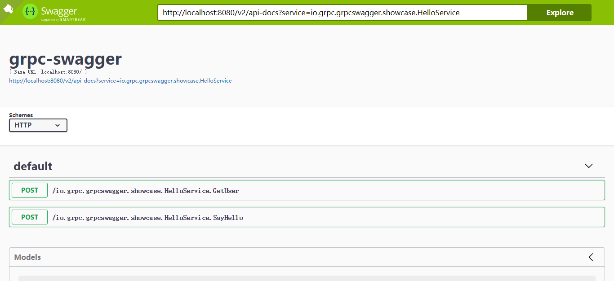
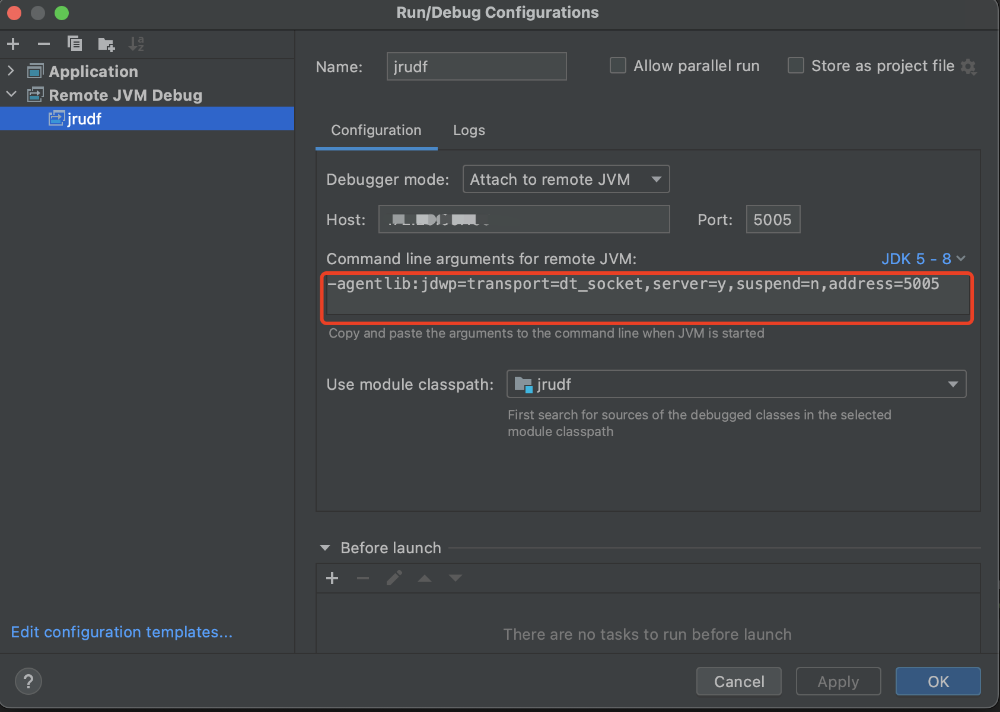

# Doris  Remote UDF 方案
> By [Siu]() 2021/3/15


## Remote UDF 介绍

>  以下参考官方的文档：
>
>  Remote UDF Service 支持通过 RPC 的方式访问用户提供的 UDF Service，以实现用户自定义函数的执行。相比于 Native 的 UDF 实现，Remote UDF Service 有如下优势和限制：
>
>  优势
>
>  - 跨语言：可以用 Protobuf 支持的各类语言编写 UDF Service。
>  - 安全：UDF 执行失败或崩溃，仅会影响 UDF Service 自身，而不会导致 Doris 进程崩溃。
>  - 灵活：UDF Service 中可以调用任意其他服务或程序库类，以满足更多样的业务需求。
>
>  使用限制
>
>  - 性能：相比于 Native UDF，UDF Service 会带来额外的网络开销，因此性能会远低于 Native UDF。同时，UDF Service 自身的实现也会影响函数的执行效率，用户需要自行处理高并发、线程安全等问题。
>  - 单行模式和批处理模式：Doris 原先的的基于行存的查询执行框架会对每一行数据执行一次 UDF RPC 调用，因此执行效率非常差，而在新的向量化执行框架下，会对每一批数据（默认2048行）执行一次 UDF RPC 调用，因此性能有明显提升。实际测试中，基于向量化和批处理方式的 Remote UDF 性能和基于行存的 Native UDF 性能相当，可供参考


**所以， Doris Remote UDF 开发，其实就是开发一个 RPC 服务，以 RPC 访问的方式提供 UDF 服务。**


## Remote UDF 开发

> 主要是 RPC Server 部分的开发。

### 设计


### 开发

#### 编译 proto

***需要安装 protoc 环境***

从官方 proto file进行编译，当前已经编译放在 `libs/doris-rudf-grpclib.jar`

#### 代码结构 

```shell
.
├── libs
│   └── doris-rudf-grpclib.jar # proto 编译的包，作为 local lib
├── proto # 原始 proto 文件
│   ├── function_service.proto
│   └── types.proto
├── src
│   └── main
│       ├── java
│       │   ├── com
│       │   │   └── siu
│       │   │       └── udf
│       │   │           └── SubFunction.java # 实现 IFunction，会以 SPI 的方式注册到 Functions 
│       │   └── org
│       │       └── apache
│       │           └── doris
│       │               └── udf
│       │                   ├── Main.java # 入口
│       │                   ├── func
│       │                   │   ├── Functions.java # 单例，以SPI 方式加载 UDF
│       │                   │   └── IFunction.java # 函数接口定义，需要实现 call(),check(),getName()
│       │                   └── server
│       │                       ├── FunctionServiceImpl.java # Doris Remote UDF 定义的接口，这里需要实现 checkFn(), callFn(),handShake()
│       │                       └── RpcServer.java
│       └── resources
│           └── META-INF
│               └── services
│                   └── org.apache.doris.udf.func.IFunction # SPI 定义文件
└── target # target code
```


#### 编译和运行

```shell
# 编译
mvn package
```

```shell
# 运行
java -jar jrudf-jar-with-dependencies.jar 9000
```
`9000` 是默认端口，可以不传


## Remote UDF 调试

> 推荐远程调试，在 Remote UDF 场景中远程调试是最有效的，因为整体上还要依赖一个 Doris 的调试环境，所以远程调试的方式是一个全流程的验证。如果用支持grpc proto file 的工具调试只有 rpc server 部分的调试，不能完整的测试功能。

### proto file 调试

- Postman ：最新版本支持 GRPC，可以通过界面去调试比较友好
- BloomRPC ：很适合 GRPC 的界面调试工具
- Evans ：一个 RPC 命令行调试工具

### Swagger 调试

- 使用 [grpc-swagger](https://github.com/grpc-swagger/grpc-swagger) 这个项目:

  ```shell
  java -jar grpc-swagger-web/target/grpc-swagger.jar --server.port=8888
  ```

- 在 RPC Server 中开启反射模式：

  ```java
              server = ServerBuilder.forPort(port)
                      .addService(... some server)
                      .addService(ProtoReflectionService.newInstance()) // 反射模式，可以把这块代码用 debug 控制 
                      .build()
                      .start();
  ```
  
- 打开 Swagger

  

### IDEA 远程调试

远程服务器上启动服务
```shell
java -agentlib:jdwp=transport=dt_socket,server=y,suspend=n,address=[ip]:5005 -jar jrudf-jar-with-dependencies.jar
# 后台运行
nohup java -agentlib:jdwp=transport=dt_socket,server=y,suspend=n,address=[ip]:5005 -jar jrudf-jar-with-dependencies.jar >jrudf.log 2>&1 &
```
本地 IDEA 添加 Remote 配置:
`Edit Configurtions-> Add New Configrution->Remote JVM Debug`




## Remote UDF 测试

### 功能测试

#### 在 Doris 上创建 UDF
目前暂不支持 UDAF 和 UDTF
```sql
CREATE FUNCTION
name ([,...])
[RETURNS] rettype
PROPERTIES (["key"="value"][,...])
```
说明：
```txt
PROPERTIES中symbol表示的是 rpc 调用传递的方法名，这个参数是必须设定的。
PROPERTIES中object_file表示的 rpc 服务地址，目前支持单个地址和 brpc 兼容格式的集群地址，集群连接方式 参考 格式说明 (opens new window)。
PROPERTIES中type表示的 UDF 调用类型，默认为 Native，使用 Rpc UDF时传 RPC。
name: 一个function是要归属于某个DB的，name的形式为dbName.funcName。当dbName没有明确指定的时候，就是使用当前session所在的db作为dbName。

```

***注：特别说明，PROPERTIES.symbol 和 name 强制一致，发现在 set enable_vectorized_engine=true 调用传的函数名是 name，false 时传 symbol***

示例：

```sql
CREATE FUNCTION rpc_add(INT, INT) RETURNS INT PROPERTIES (
"SYMBOL"="add_int",
"OBJECT_FILE"="127.0.0.1:9000",
"TYPE"="RPC"
);
```

#### 使用 UDF
用户使用 UDF 必须拥有对应数据库的 SELECT 权限。

UDF 的使用与普通的函数方式一致，唯一的区别在于，内置函数的作用域是全局的，而 UDF 的作用域是 DB内部。当链接 session 位于数据内部时，直接使用 UDF 名字会在当前DB内部查找对应的 UDF。否则用户需要显示的指定 UDF 的数据库名字，例如 dbName.funcName。

#### 删除 UDF
当你不再需要 UDF 函数时，你可以通过下述命令来删除一个 UDF 函数, 可以参考 DROP FUNCTION


***注：测试结论一并在性能测试部分说明***


### 性能测试


#### 测试模型

> #### 说明
>
> Native UDF 在性能上有天然的优势，所以比较性能时，需要开启 Doris 的向量化引擎才有比较的意义，这里只是简单的设计几个对照组，每组执行10次查询，分别为：
>
> - Build-in Function（`lenght()`）
> - Native UDF
> - Remote UDF 1 （enable_vectorized_engine = false） ***这一组测试无法完成***
> - Remote UDF 2（enable_vectorized_engine = true，batch_size = 1024）
> - Remote UDF 3（enable_vectorized_engine = true，batch_size = 2048）
> - Remote UDF 4（enable_vectorized_engine = true，batch_size = 4096）
> - Remote UDF 5（enable_vectorized_engine = true，batch_size = 8192）
>
> ***注：UDF 的实现逻辑 str.length()***，内置函数选取 length() 进行比较
>
> 测试工具：mysqlslqp
>
> 测试数据：使用 Doris SSB 中的 Customer 表，150 万
>
> 测试环境：3 be 32G/8C，RPC Server JVM 默认
>
> Doris 版本（由于当前版本不支持 remote UDF ，所以采用主干分支的编译版本，编译方式参考附录中的文档）：
> ​	branch master
> ​	latest commit [`f4663ad`](https://github.com/apache/incubator-doris/commit/f4663ad2eb3fc8ce929304ccdea09d87bb86ec8a)
> ​	Compiled from the official docker image


#### 测试结果

单节点的 rpc server 下得出如下测试数据：

```shell
##########################################################################
全局参数：
client_num=10
queries_num=10
测试结果： 
test_name        mode   avg    min    max    client_num  queries_per_client
build-in         mixed  1.784  1.669  1.856  10          1
n-udf-f          mixed  1.865  1.791  1.957  10          1
r-udf-2-t-1024   mixed  3.609  3.388  3.787  10          1
r-udf-3-t-2048   mixed  3.032  2.748  3.775  10          1
r-udf-4-t-4096   mixed  2.506  2.347  2.942  10          1
r-udf-5-t-8192   mixed  2.178  2.059  2.374  10          1
r-udf-6-t-16384  mixed  1.971  1.848  2.271  10          1
#########################################################################
```


在 3 个节点的 rpc server 下得出如下测试数据：

```shell
##########################################################################
全局参数：
client_num=10
queries_num=10
测试结果： 
test_name        mode   avg    min    max    client_num  queries_per_client
build-in         mixed  1.683  1.252  1.923  10          1
n-udf-f          mixed  1.797  1.694  1.912  10          1
r-udf-2-t-1024   mixed  2.384  1.882  3.388  10          1
r-udf-3-t-2048   mixed  1.688  1.479  1.886  10          1
r-udf-4-t-4096   mixed  1.455  1.374  1.615  10          1
r-udf-5-t-8192   mixed  1.358  1.272  1.436  10          1
r-udf-6-t-16384  mixed  1.329  1.265  1.474  10          1
#########################################################################
```

#### 测试结论

1. Native UDF 与内置函数的**性能基本一致**
2. 在非向量化引擎的环境下（enable_vectorized_engine = false），Remote UDF 性能**极差**
3. 在向量化引擎的环境下（enable_vectorized_engine = true），Native UDF **无法使用**
4. **推荐**使用配置 enable_vectorized_engine = true，batch_size = 4096 （实际做了几十次验证，这个配置是最稳定的）
5. 在 **4** 推荐配置下，单节点 rpc server 时，Remote UDF 与 Native UDF **性能差距大概有 35%**
6. 在 **4** 推荐配置下，3 节点 rpc server 时，Remote UDF 与 Native UDF **性能领先大概有 36%**（此时 Doris 没有明显瓶颈，目前没有准确的数据去描述节点数量对于Remote UDF 性能的线性影响有多大，不排除在更高规格下 Native UDF 可能表现更佳）
   - 这个结论符合官方的描述`基于向量化和批处理方式的 Remote UDF 性能和基于行存的 Native UDF 性能相当`
7. 不排除处理复杂的自定义函数时 Remote UDF 性能表现会下降，特别是有大量数据要通过网络传输时，推荐配置也会随场景不同有所不同


## 总结

**从整体方案上做一下总结和对比：**

|            | Native UDF                                                   | Remote UDF                                                   |
| ---------- | ------------------------------------------------------------ | ------------------------------------------------------------ |
| 用户       | 使用方式上与内置函数一致的体验                               | 使用方式上与内置函数一致的体验                               |
| 社区       | 当前版本支持                                                 | **预计下一个版本支持；这个对稳定性、安全也有较大的影响，当前功能验证是基于主干版本编译的** |
| 功能       | 满足                                                         | 满足（***当前版本不支持***）                                 |
| 稳定性     | 需要代码来保证                                               | 需要代码来保证（***当前版本不支持，编译版本可能会引入不稳定因素***） |
| 性能       | 多数情况下会好于 Remote UDF                                  | 在向量化和批处理模式下性能与 Native 相当；具备一定的伸缩能力 |
| 安全       | 不可靠的程序，会直接影响 Doris                               | 相对更安全；特别是使用 VM 的语言                             |
| 开发和维护 | 相对成本**高**：<br>1、C 系技术栈能力当前团队储备不足，长期来看无投入计划<br>2、C 系语言的程序编写、debug、优化、review 等心智成本较高<br>3、在处理复杂的自定义逻辑时，**2** 的挑战会放大（本身编码的经验；类库的缺乏， Java ，Python 对数据处理相对友好） | 相对成本**低**：<br/>跨语言，类库多；一次性的投入，定义好开发范式，可以长期收益 |

在不考虑团队技能情况下，选择 Native UDF 的方案是比较合适的，功能上满足，性能相对更稳定；Remote UDF 现阶段社区的版本不支持，是一个比较大的问题，编译是一个，主要还是非 release 版本的**稳定性**和**安全**是一个比较大的挑战。

所以所有方案到最后都不是讨论好不好的问题，而是合不合适的问题。

综合考虑功能、稳定性是我们迫切的需求，性能上都有基本同等级别的实现方式：现阶段使用 Native UDF 去支持需求；长期来看，待社区版本稳定支持 Remote UDF 时，定义好开发范式，用当前团队熟悉的技术栈来开发 UDF RPC Server 来迁移当前的需求。


# 附录

## 编译 Doris

***由于当前版本（0.15）不支持 Remote UDF，所以编译 Doris 最新版本进行功能验证***

### 安装 Docker 环境 （略）
***推荐使用 Docker 集成的编译环境去进行 Doris 编译***

### 下载编译集成环境镜像

```shell
docker pull apache/incubator-doris:build-env-ldb-toolchain-latest
```
### 下载 Doris 源码

```shell
mkdir -p /opt/doris && cd /opt/doris
git clone https://github.com/apache/incubator-doris.git
```
### 运行编译集成环境
```shell
docker run -it -v /root/.m2:/root/.m2 -v /opt/doris/incubator-doris/:/root/incubator-doris/ apache/incubator-doris:build-env-ldb-toolchain-latest
```

### 编译
```shell
cd /root/incubator-doris/
sh build.sh --clean --be --fe --ui
```

### 打包构建
```shell
tar zcvf apache-doris-latest-454b45b-incubating.tar.gz ./output
```
***454b45b 是源码的 commit hash id***


## 问题

- proto 编译要修改官方的 pom文件中 `protoc` 环境的位置

```xml
<protocCommand>${doris.thirdparty}/installed/bin/protoc</protocComm> <!-- 修改成 protoc 的安装位置 -->
```

- Doris 源码编译时 gcc  找不到，版本不对

  需要 which 一下看看 gcc 的位置，在 `env.sh` 中设置一下 `${DORIS_GCC_HOME}`


## ref

- [Doris Remote UDF](https://doris.apache.org/zh-CN/extending-doris/udf/remote-user-defined-function.html)
- [Doris 编译](https://doris.apache.org/zh-CN/installing/compilation.html#%E4%BD%BF%E7%94%A8-docker-%E5%BC%80%E5%8F%91%E9%95%9C%E5%83%8F%E7%BC%96%E8%AF%91-%E6%8E%A8%E8%8D%90)
- [mysqlslap](https://dev.mysql.com/doc/refman/8.0/en/mysqlslap.html)
